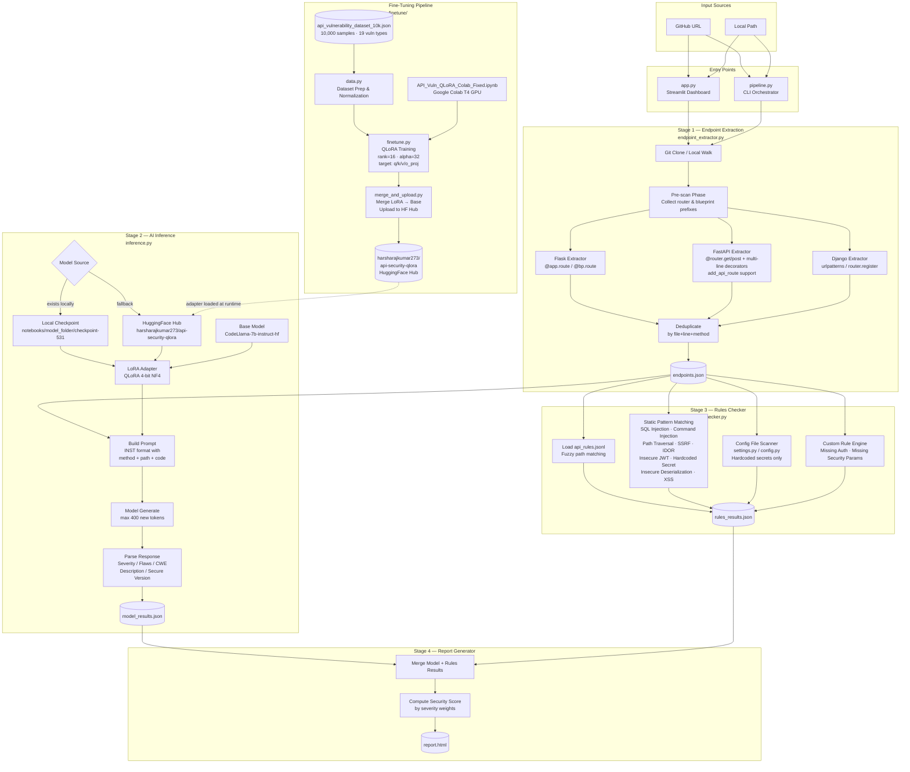

# 🔒 API Security Scanner

An end-to-end API vulnerability detection system that combines structural code analysis, a fine-tuned **Code Llama 7B** model, and a rule-based validation engine. It is designed to scan GitHub repositories and detect both code-level logic flaws and contract-level spec violations.

---

## 🏗️ Architecture: The 4-Stage Audit

Our approach separates vulnerability detection into four distinct, interoperable stages:

1.  **Structural Discovery (`endpoint_extractor.py`)**: Uses a robust multi-mode parser (Brace-matching for C-style languages, Indentation-tracking for Python/Ruby) to map API endpoints across 10+ languages and frameworks.
2.  **AI Inspection (`inference.py`)**: Leverages a fine-tuned Code Llama model (QLoRA) to perform deep-code analysis. It detects vulnerabilities like SQLi, IDOR, and Mass Assignment, providing both an analysis and a recommended secure implementation.
3.  **Policy Validation (`rules_checker.py`)**: A rule-based engine that validates extracted code against custom security policies or OpenAPI specs using advanced fuzzy path matching (`/api/users/{id}` → `api/users/:param`).
4.  **Report Generation (`report_generator.py`)**: Merges AI and rules results, computes a security score by severity weight, and produces an interactive HTML report.

---

## 🗺️ System Design



---

## 🚀 Quick Start

### 1. Install Dependencies
```bash
pip install streamlit gitpython requests transformers peft torch pyyaml
```

### 2. Launch the Dashboard
```bash
streamlit run app.py
```

### 3. CLI Alternative
For headless environments or CI/CD pipelines:
```bash
python pipeline.py --repo https://github.com/user/api-repo --model_dir ./finetuned_model/final
```

---

## 🖥️ Dashboard Features

*   **Repository Discovery**: Search GitHub directly from the UI or paste a URL to initiate an audit.
*   **Audit Mode Selector**:
    *   **Quick**: Scans the first 20 endpoints.
    *   **Standard**: Scans up to 50 endpoints.
    *   **Comprehensive**: Audits every detected endpoint in the codebase.
*   **Custom Rules Engine**: Upload `.jsonl` rules, `.yaml` OpenAPI specs, or even `.md` documentation to use as security test cases.
*   **Interactive Reports**:
    *   **Security Score**: Real-time grading based on vulnerability count and severity.
    *   **Remediation Tabs**: View vulnerable code side-by-side with model-generated secure versions.
    *   **Export**: Download full audit results as structured JSON reports.

---

## 🔍 Supported Ecosystems

| Language | Supported Frameworks |
| :--- | :--- |
| **Python** | Flask, FastAPI, Django |
| **JavaScript/TS** | Express.js, NestJS |
| **Java** | Spring Boot |
| **PHP** | Laravel |
| **Go** | Gin, net/http |
| **Ruby** | Ruby on Rails |
| **C#** | ASP.NET Core |

---

## 📊 Dataset Insights

The model was fine-tuned on a high-quality, diverse dataset of **10,000 API-specific vulnerability samples**. This dataset provides the foundation for the scanner's ability to recognize complex security patterns across multiple ecosystems.

### 🌐 Language & Framework Distribution
The training data covers a wide range of modern back-end technologies, ensuring robust cross-language performance:

*   **Python (46%)**: Dominated by Flask and Django samples.
*   **JavaScript (25%)**: Primarily focused on Express.js middleware and handlers.
*   **Java (15%)**: Comprehensive coverage of Spring Boot REST controllers.
*   **PHP, Go, Ruby, C# (14%)**: Targeted samples for Laravel, Gin, Rails, and ASP.NET.

### 🛡️ Vulnerability Landscape
Our dataset specifically targets the most critical API security risks (OWASP API Top 10):

| Top Vulnerability Types | Count | Common CWEs |
| :--- | :--- | :--- |
| **SQL Injection** | 2,425 | CWE-89 |
| **Mass Assignment** | 1,307 | CWE-915 |
| **Path Traversal** | 943 | CWE-22 |
| **IDOR** | 860 | CWE-639 |
| **Broken Authorization** | 792 | CWE-285 |
| **Command Injection** | 600 | CWE-78 |

### 📈 Severity Breakdown
*   **Critical (43%)**: Direct RCE, SQLi, or unauthorized admin access.
*   **High (41%)**: Data leaks, IDOR, and severe authorization bypass.
*   **Medium/None (16%)**: XSS, input validation warnings, and "Clean" baseline samples to reduce false positives.

---

## 🧠 Fine-Tuning & Data

*   **Model**: `CodeLlama-7b-instruct-hf`
*   **Method**: QLoRA (4-bit NF4 quantization) for efficient training on T4/16GB VRAM.
*   **Dataset**: ~10,000 samples (synthetic + augmented) covering 19 vulnerability types (SQLi, OS Command Injection, Path Traversal, etc.).
*   **Resilient Parsing**: The inference engine is equipped with a high-resilience parser that handles varying LLM output formats and structured JSON blocks.

---

## 📁 Project Structure

```text
api-security/
├── app.py                    # Streamlit dashboard (entry point)
├── pipeline.py               # CLI orchestrator (entry point)
├── endpoint_extractor.py     # Multi-language endpoint mapper
├── inference.py              # Model inference engine
├── rules_checker.py          # Fuzzy-matching policy validator
├── report_generator.py       # HTML/JSON report builder
├── data/
│   ├── api_rules.jsonl           # Security rules dataset
│   └── api_vulnerability_dataset_10k.json  # Training dataset
├── finetune/
│   ├── finetune.py           # QLoRA training script
│   ├── data.py               # Dataset preparation & normalization
│   └── extract_rules.py      # Rules extraction from OpenAPI/Markdown
├── notebooks/
│   └── API_Vuln_QLoRA_Colab_Fixed.ipynb  # Training notebook
├── Dockerfile
├── docker-compose.yml
├── requirements.txt          # App dependencies
└── requirements-ml.txt       # ML/training dependencies
```

---

## 👥 Team & Credits

**CS6380 — API Security Project**
Developed by: Siddhanth Nilesh Jagtap · Tanuj Kenchannavar · Harsha Raj Kumar

## QloRA_Model Document
https://docs.google.com/document/d/1Gr8nihhJKUCkgGdu-fUO2g-c9134bzZ7oMeGSMI-oqw/edit?usp=sharing
